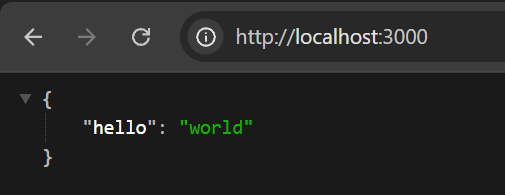

# Aula 1 - Criando o Primeiro Servidor da API (Node.js + Fastify)
## 🎯 Objetivo
Nesta aula, vamos configurar o ambiente do nosso projeto backend, instalar o Fastify e criar nosso primeiro servidor rodando localmente.

## 🧱 Passo a Passo
### 1. Criação do Projeto
Crie uma nova pasta com o nome do projeto e abra no VSCode:

```txt
mkdir projeto-backend
cd projeto-backend
code .
```

### 2. Inicializando o Projeto Node
No terminal, dentro da pasta do projeto, execute:

```
npm init -y
```
> O -y serve para aceitar todas as opções padrão automaticamente.

### 3. Estrutura do package.json
Após o comando, um arquivo chamado package.json será criado com o seguinte conteúdo:

````json
{
  "name": "projeto-backend",
  "version": "1.0.0",
  "description": "",
  "main": "index.js",
  "scripts": {
    "test": "echo \"Error: no test specified\" && exit 1"
  },
  "keywords": [],
  "author": "",
  "license": "ISC"
}
````

### Explicação dos campos principais:
"name": Nome do projeto

"version": Versão do projeto

"main": Arquivo principal de entrada

"scripts": Comandos que podem ser executados via terminal (ex: npm run test)

"license": Tipo de licença do projeto (ISC é padrão do Node)

### 4. Instalando o Fastify
O que é o Fastify?
Fastify é um framework web leve e rápido para Node.js, ideal para criar APIs de forma simples e performática.

📚 Documentação oficial: https://fastify.dev/docs/latest/Guides/Getting-Started/

Instalação:
```
npm install fastify
```

### 5. Criando o Primeiro Servidor
Estrutura de pastas recomendada:

```
projeto-backend/
├── node_modules/
├── package.json
└── srv/
    └── server.js
```
Código do servidor – srv/server.js:

```js
import Fastify from 'fastify'

const api = Fastify({
  logger: true
})

api.get('/', function (request, reply) {
  reply.send({ hello: 'world' })
})

const start = async () => {
  try {
    await api.listen({ port: 3000 })
  } catch (err) {
    api.log.error(err)
    process.exit(1)
  }
}
start()
```

### 6. Explicando o Código

import Fastify from 'fastify': importa o framework

Fastify({ logger: true }): habilita logs no console

api.get('/', ...): cria uma rota GET no caminho /

reply.send({ hello: 'world' }): resposta da API

api.listen({ port: 3000 }): inicia o servidor na porta 3000

try/catch: trata erros que possam ocorrer ao subir o servidor

### 7. Testando a API
Execute o servidor com:

```
node srv/server.js
````
Acesse no navegador:
http://localhost:3000




Resposta esperada:


{
  "hello": "world"
}


## 📌 Dicas Extras
Para que o import funcione, adicione "type": "module" no seu package.json.

Se preferir usar require, adapte o código para o padrão CommonJS:


const fastify = require('fastify')({ logger: true })

fastify.get('/', (req, reply) => {
  reply.send({ hello: 'world' })
})

fastify.listen({ port: 3000 })

## 📋 Resumo da Aula

Inicializamos o projeto Node com npm init -y
Instalamos o framework Fastify com npm install fastify
Criamos a estrutura de pastas e o arquivo server.js
Desenvolvemos um servidor simples com uma rota GET
Entendemos cada parte do código
Rodamos a API localmente e testamos no navegador